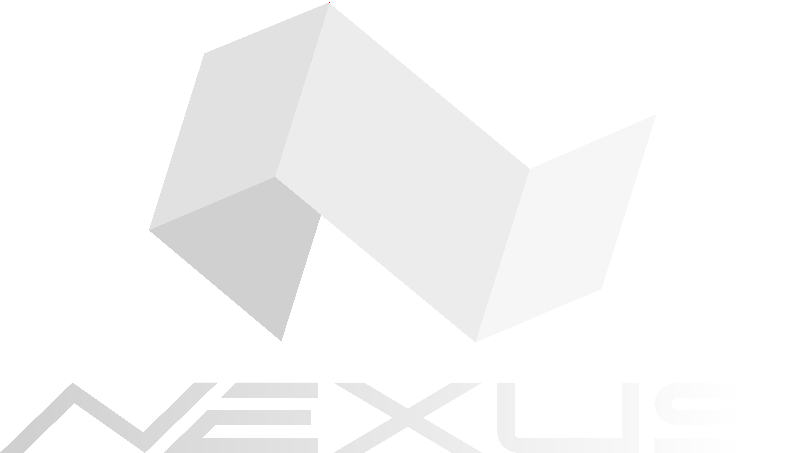

<div style="text-align: center;">
  
</div>

<br>

# Nexus Digital Agency Website

Nexus Digital Agency — Your Gateway to Digital Excellence. Explore our innovative solutions, creative expertise, and transformative digital experiences. Join us on a journey where imagination meets reality.

## Preview
 
<details>
  <summary>Click to expand for more images</summary>

  
  
  
    


</details>

## Live Demo

🌐 Explore the live demo of the Nexus Digital Agency Website: [**Live Demo**](https://sami-souissi.github.io/Nexus_Digital_Agency_Website/) <!-- Replace with the actual live demo URL -->

Feel free to interact with the website and experience its features in action.


## Table of Contents

- [Overview](#overview)
- [Tech Stack](#tech-stack)
- [Features](#features)
- [Getting Started](#getting-started)
- [Usage](#usage)
- [Contributing](#contributing)
- [License](#license)

## Overview

The Nexus Digital Agency Website is a platform that provides a gateway to digital excellence. It offers innovative solutions, creative expertise, and transformative digital experiences for users. This website is designed to showcase the agency's services, expertise, and the impact of their work.

## Tech Stack

### Frontend:

- 
- 
- 
- 

### Hosting/Deployment:
- 


## Features

- **Parallax Scrolling Technique:** Engage users with visually stunning parallax scrolling effects that create depth and enhance the overall user experience.

- Showcase client projects and success stories.

- Provide contact information for inquiries and collaboration.

- Interactive elements for a user-friendly experience.


## Getting Started

To get started with the Nexus Digital Agency Website, follow these steps:

1. Clone this repository to your local machine.
   ```bash
   git clone https://github.com/Sami-Souissi/Nexus_Digital_Agency_Website.git

## Usage

This website is designed to be simple to use. Follow these steps to get started with local development:

1. Clone this repository to your local machine:

   ```bash
   git clone https://github.com/Sami-Souissi/Nexus_Digital_Agency_Website.git
   ```

2. Navigate to the project directory:

   ```bash
   cd Nexus_Digital_Agency_Website
   ```

3. Launch a local server. You can use tools like Python's built-in HTTP server for quick testing:

   ```bash
   python -m http.server
   ```

   For Python 2, use:

   ```bash
   python -m SimpleHTTPServer
   ```

4. Open your web browser and go to `http://localhost:8000` to view the website locally.

5. Explore the website and interact with its features.

## Contributing
We welcome contributions to improve the Nexus Digital Agency Website. If you'd like to contribute, please follow these guidelines:

Fork the repository.
Create a new branch for your feature or fix.
Make your changes and commit them.
Push your changes to your fork.
Submit a pull request to the main repository.


## License

This project is licensed under the [MIT License](LICENSE.md) - see the [LICENSE.md](LICENSE.md) file for details.
